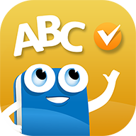
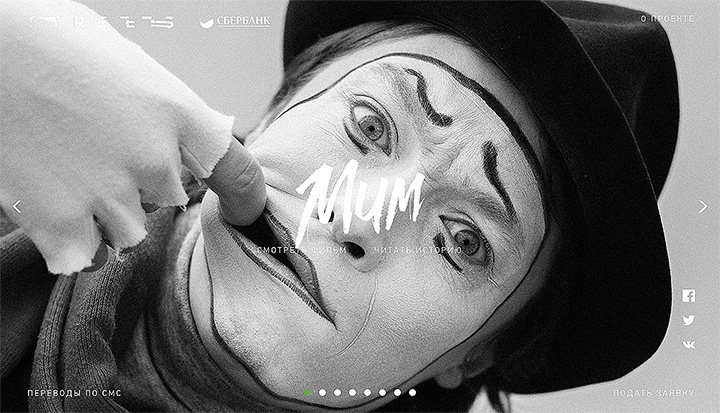

  Hi there. I'm Dmitry Sher. I'm full-stack web developer, trying to live his interesting live with a great people. Making great things. Things that bring you a 'wow' moment.

<h2>Featured projects:</h2>

  

    
    
BoonUp

    
CTO

    
Meteor.js

    
Social network for swapping things and services

  

  

    
    
BoomTararam

    
CTO

    
Meteor.js, React

    
Marketplace for auto services, competing for drivers' requests

  

  

    
    
Vocaboo

    
CTO

    
Cordova, Phaser, Cocos-2dx

    
Series of language apps for children

  

  

    
    
Sberbank Streets

    
Front-end engineer

    
Gulp, SASS

    
Sberbank Streets promo campaign website

  

<h2>Skills:</h2>

 * OOP, design patterns, backend, frontend. I also have significant experience with C++, C#/.NET + ASP.NET.
 * Advanced Javascript (ES2016) - vanilla, jquery, framework’d.
 * Advanced CSS3 + HTML5. SASS/LESS.
 * MySQL, MongoDB.
 * React Native.
 * Lua, Coffeescript.
 * Linux (ubuntu), bash. DevOps intermediate.
 * Apache, nginx.
 * Cordova @ Android, Cordova @ iOS
 * Facebook API.
 * Gulp, webpack.
 * Basic Obj-C, basic java.
 * Close knowledge of deployment to Google Play Market and Apple AppStore.

---

<table>
  <tr><td>skype</td><td>dmitry.sher</td></tr>
  <tr><td>whatsapp</td><td>+7-985-296-79-45</td></tr>
  <tr><td>telegram</td><td>+7-985-296-79-45</td></tr>
  <tr><td>phone</td><td><a href="tel:+79852967945">+79852967945</a></td></tr>
  <tr><td>email</td><td><a href="mailto:dima.virtuallight@gmail.com">dima.virtuallight@gmail.com</a></td></tr>
  </tr>
</table>
